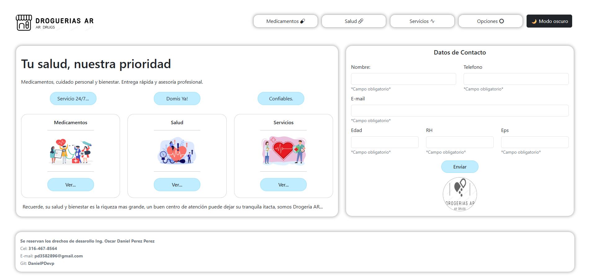
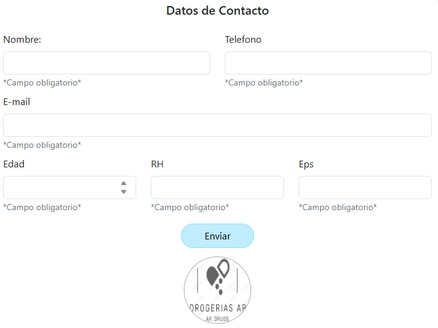

# Landing Page – AR Droguerías

## Descripción breve
Este proyecto es una **landing page para una droguería** llamada **AR Droguerías**.  
La página presenta los servicios principales (Medicamentos, Salud y Servicios), un formulario de contacto, modales interactivos y un botón de **modo oscuro**, brindando una experiencia moderna y fácil de usar para los clientes.

---

## 🛠️ Tecnologías usadas
- **HTML5** – Estructura del sitio.
- **CSS3** – Estilos personalizados y responsivos.
- **Bootstrap 5.3.8** – Sistema de rejilla, componentes y modales.
- **Bootstrap Icons** – Iconografía de farmacia y servicios.
- **JavaScript (funcion.js)** – Lógica de interacción, modales y formularios.
- **SweetAlert2** – Alertas interactivas y notificaciones.

---

##  Capturas de pantalla

###  Pantalla principal


###  Modal de Medicamentos


###  Formulario de Contacto


---

##  Cómo ejecutar el proyecto
1. Clonar el repositorio:
   ```bash
   git clone https://github.com/usuario/drogueria-landing.git
   ```
2. Abrir el archivo `index.html` en el navegador.
3. Asegurarse de tener la carpeta `css/`, `js/` y `img/` con los archivos correspondientes.

---

##  Autor
- **Oscar Daniel Pérez Pérez**  
 Cel: 316-467-8564  
 Email: pd3582896@gmail.com  
 GitHub: [DanielPDevp](https://github.com/DanielPDevp)  

---

##  Licencia
Este proyecto se desarrolla con fines académicos y de práctica.  
Se reservan los derechos de desarrollo.
